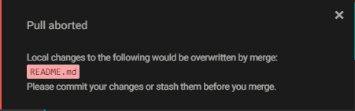
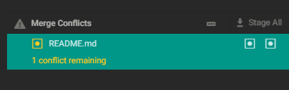
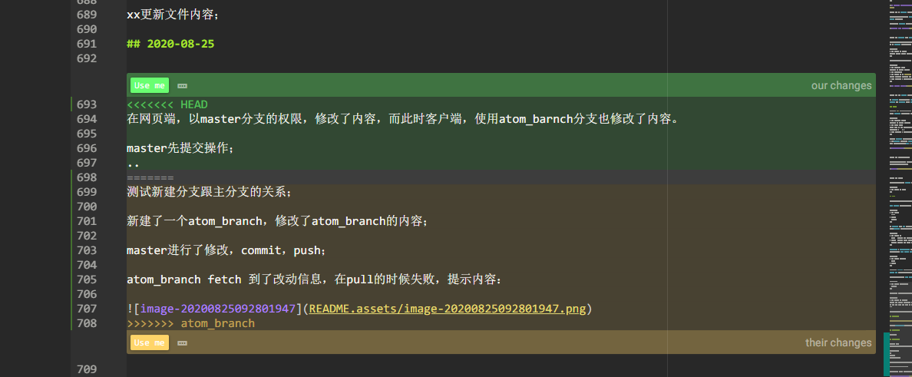
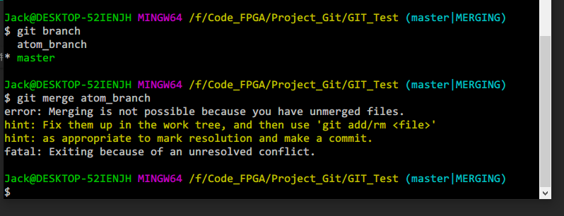
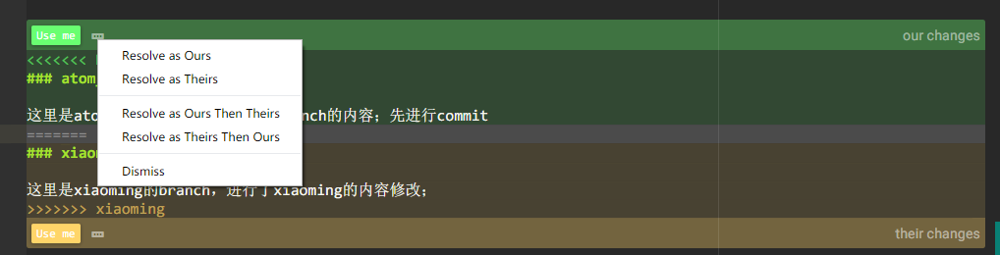

# GIT 常用命令记录

## 经常使用的命令

git status


## 遇到的问题

### 问题1
git删除了本地文件，从远程仓库中恢复在本地删除了文件，使用git pull，无法从远程项目中拉取下来。

具体操作
查看项目的状态，会显示出你删除的数据

git status     
进入被删除的文件的目录下,假设删除的文件名为 test.txt
然后进行下列操作，可以成功找回：

git reset HEAD test.txt
git checkout test.txt


其中git-bash.exe可以让我们使用Linux的命令去操作Git。而git-cmd.exe则是使用Windows命令操作Git。
事实证明还是使用Linux指令操作Git比较方便，所以我们双击git-bash.exe，在本地创建ssh key：
$ ssh-keygen -t rsa -C "your_email@youremail.com"
后面的是你注册GitHub时候的邮箱地址，后面的一些操作我们默认回车就可以。如下：
————————————————
版权声明：本文为CSDN博主「光仔December」的原创文章，遵循CC 4.0 BY-SA版权协议，转载请附上原文出处链接及本声明。
原文链接：https://blog.csdn.net/acmman/article/details/77621253

验证是否绑定本地成功，在git-bash中验证，输入指令：
$ ssh -T git@github.com
如果第一次执行该指令，则会提示是否continue继续，如果我们输入yes就会看到成功信息：

由于GitHub每次执行commit操作时，都会记录username和email，所以要设置它们：

git config --global user.name ""
git config --global user.eamil""


此时我们需要将本地仓库上传至GitHub，我们在G盘下创建了一个名为“git_repo”的文件夹，
作为本地仓库，然后在其中放置了一个Web应用的源代码（学生信息管理系统）

git init
git add *
git commit -m "commit"

git remote add orgin url


总结：代码先提交到本地库，然后提交远程库，远程库也可以更新到本地库。
创建新仓库的指令：
git init //把这个目录变成Git可以管理的仓库
git add README.md //文件添加到仓库
git add . //不但可以跟单一文件，还可以跟通配符，更可以跟目录。一个点就把当前目录下所有未追踪的文件全部add了 
git commit -m "first commit" //把文件提交到仓库
git remote add origin git@github.com:yourname/youremail.git //关联远程仓库
git push -u origin master //把本地库的所有内容推送到远程库上
————————————————
版权声明：本文为CSDN博主「光仔December」的原创文章，遵循CC 4.0 BY-SA版权协议，转载请附上原文出处链接及本声明。
原文链接：https://blog.csdn.net/acmman/article/details/77621253


git branch
查看分支

git checkout name
跳转到分支

git merge name
合并分支

git branch -d name
删除分支

git status
查看因包含合并冲突而处于未合并状态的文件；

## 学习记录的命令


## 链接引用

1. [官方手册](https://git-scm.com/book/zh/v2/Git-%E5%9F%BA%E7%A1%80-%E8%8E%B7%E5%8F%96-Git-%E4%BB%93%E5%BA%93)

## 添加测试行

## 跟着官网的命令敲下去

在 Windows 上：

$ cd /c/user/my_project
之后执行：

$ git init

如果在一个已存在文件的文件夹（而非空文件夹）中进行版本控制，你应该开始追踪这些文件并进行初始提交。 可以通过 git add 命令来指定所需的文件来进行追踪，然后执行 git commit ：


```
$ git add *.c
$ git add LICENSE
$ git commit -m 'initial project version'
```

如果你想在克隆远程仓库的时候，自定义本地仓库的名字，你可以通过额外的参数指定新的目录名：
$ git clone https://github.com/libgit2/libgit2 mylibgit

可以用 git status 命令查看哪些文件处于什么状态。 如果在克隆仓库后立即使用此命令，会看到类似这样的输出：

$ git status
On branch master
Your branch is up-to-date with 'origin/master'.
nothing to commit, working directory clean


跟踪新文件
使用命令 git add 开始跟踪一个文件。 所以，要跟踪 README 文件，运行：

$ git add README
此时再运行 git status 命令，会看到 README 文件已被跟踪，并处于暂存状态：

$ git status
On branch master
Your branch is up-to-date with 'origin/master'.
Changes to be committed:
  (use "git restore --staged <file>..." to unstage)

    new file:   README
只要在 Changes to be committed 这行下面的，就说明是已暂存状态。 如果此时提交，那么该文件在你运行 git add 时的版本将被留存在后续的历史记录中。 你可能会想起之前我们使用 git init 后就运行了 git add <files> 命令，开始跟踪当前目录下的文件。 git add 命令使用文件或目录的路径作为参数；如果参数是目录的路径，该命令将递归地跟踪该目录下的所有文件。

需要明白几个词
untracked 未追踪
unmodified 未修改
modified 修改
staged 已保存(自己这么理解的)


还有**忽略文件**设置；

提交更新

现在的暂存区已经准备就绪，可以提交了。 在此之前，请务必确认还有什么已修改或新建的文件还没有 `git add` 过， 否则提交的时候不会记录这些尚未暂存的变化。 这些已修改但未暂存的文件只会保留在本地磁盘。 所以，每次准备提交前，先用 `git status` 看下，你所需要的文件是不是都已暂存起来了， 然后再运行提交命令 `git commit`：

```console
$ git commit
```

### 移除文件

要从 Git 中移除某个文件，就必须要从已跟踪文件清单中移除（确切地说，是从暂存区域移除），然后提交。 可以用 `git rm` 命令完成此项工作，并连带从工作目录中删除指定的文件，这样以后就不会出现在未跟踪文件清单中了。

如果只是简单地从工作目录中手工删除文件，运行 `git status` 时就会在 “Changes not staged for commit” 部分（也就是 *未暂存清单*）看到：

```console
$ rm PROJECTS.md
$ git status
On branch master
Your branch is up-to-date with 'origin/master'.
Changes not staged for commit:
  (use "git add/rm <file>..." to update what will be committed)
  (use "git checkout -- <file>..." to discard changes in working directory)

        deleted:    PROJECTS.md

no changes added to commit (use "git add" and/or "git commit -a")
```

然后再运行 `git rm` 记录此次移除文件的操作：

```console
$ git rm PROJECTS.md
rm 'PROJECTS.md'
$ git status
On branch master
Your branch is up-to-date with 'origin/master'.
Changes to be committed:
  (use "git reset HEAD <file>..." to unstage)

    deleted:    PROJECTS.md
```

另外一种情况是，我们想把文件从 Git 仓库中删除（亦即从暂存区域移除），但仍然希望保留在当前工作目录中。 换句话说，你想让文件保留在磁盘，但是并不想让 Git 继续跟踪。 当你忘记添加 `.gitignore` 文件，不小心把一个很大的日志文件或一堆 `.a` 这样的编译生成文件添加到暂存区时，这一做法尤其有用。 为达到这一目的，使用 `--cached` 选项：

```console
$ git rm --cached README
```

`git rm` 命令后面可以列出文件或者目录的名字，也可以使用 `glob` 模式。比如：

```console
$ git rm log/\*.log
```

注意到星号 `*` 之前的反斜杠 `\`， 因为 Git 有它自己的文件模式扩展匹配方式，所以我们不用 shell 来帮忙展开。 此命令删除 `log/` 目录下扩展名为 `.log` 的所有文件。 类似的比如：

```console
$ git rm \*~
```

该命令会删除所有名字以 `~` 结尾的文件。

### 移动文件

不像其它的 VCS 系统，Git 并不显式跟踪文件移动操作。 如果在 Git 中重命名了某个文件，仓库中存储的元数据并不会体现出这是一次改名操作。 不过 Git 非常聪明，它会推断出究竟发生了什么，至于具体是如何做到的，我们稍后再谈。

既然如此，当你看到 Git 的 `mv` 命令时一定会困惑不已。 要在 Git 中对文件改名，可以这么做：

```console
$ git mv file_from file_to
```

它会恰如预期般正常工作。 实际上，即便此时查看状态信息，也会明白无误地看到关于重命名操作的说明：

```console
$ git mv README.md README
$ git status
On branch master
Your branch is up-to-date with 'origin/master'.
Changes to be committed:
  (use "git reset HEAD <file>..." to unstage)

    renamed:    README.md -> README
```

其实，运行 `git mv` 就相当于运行了下面三条命令：

```console
$ mv README.md README
$ git rm README.md
$ git add README
```

如此分开操作，Git 也会意识到这是一次重命名，所以不管何种方式结果都一样。 两者唯一的区别是，`mv` 是一条命令而非三条命令，直接用 `git mv` 方便得多。 不过有时候用其他工具批处理重命名的话，要记得在提交前删除旧的文件名，再添加新的文件名。


## 查看提交历史

在提交了若干更新，又或者克隆了某个项目之后，你也许想回顾下提交历史。 完成这个任务最简单而又有效的工具是 `git log` 命令。

`git log` 有许多选项可以帮助你搜寻你所要找的提交， 下面我们会介绍几个最常用的选项。

其中一个比较有用的选项是 `-p` 或 `--patch` ，它会显示每次提交所引入的差异（按 **补丁** 的格式输出）。 你也可以限制显示的日志条目数量，例如使用 `-2` 选项来只显示最近的两次提交：

## 撤消操作

在任何一个阶段，你都有可能想要撤消某些操作。 这里，我们将会学习几个撤消你所做修改的基本工具。 注意，有些撤消操作是不可逆的。 这是在使用 Git 的过程中，会因为操作失误而导致之前的工作丢失的少有的几个地方之一。

有时候我们提交完了才发现漏掉了几个文件没有添加，或者提交信息写错了。 此时，可以运行带有 `--amend` 选项的提交命令来重新提交：

```console
$ git commit --amend
```

这个命令会将暂存区中的文件提交。 如果自上次提交以来你还未做任何修改（例如，在上次提交后马上执行了此命令）， 那么快照会保持不变，而你所修改的只是提交信息。

文本编辑器启动后，可以看到之前的提交信息。 编辑后保存会覆盖原来的提交信息。

例如，你提交后发现忘记了暂存某些需要的修改，可以像下面这样操作：

```console
$ git commit -m 'initial commit'
$ git add forgotten_file
$ git commit --amend
```

最终你只会有一个提交——第二次提交将代替第一次提交的结果。

| Note | 当你在修补最后的提交时，并不是通过用改进后的提交 **原位替换** 掉旧有提交的方式来修复的， 理解这一点非常重要。从效果上来说，就像是旧有的提交从未存在过一样，它并不会出现在仓库的历史中。修补提交最明显的价值是可以稍微改进你最后的提交，而不会让“啊，忘了添加一个文件”或者 “小修补，修正笔误”这种提交信息弄乱你的仓库历史。 |
| ---- | ------------------------------------------------------------ |
|      |                                                              |

| Note | 远程仓库可以在你的本地主机上你完全可以在一个“远程”仓库上工作，而实际上它在你本地的主机上。 词语“远程”未必表示仓库在网络或互联网上的其它位置，而只是表示它在别处。 在这样的远程仓库上工作，仍然需要和其它远程仓库上一样的标准推送、拉取和抓取操作。 |
| ---- | ------------------------------------------------------------ |
|      |                                                              |

### 查看远程仓库

如果想查看你已经配置的远程仓库服务器，可以运行 `git remote` 命令。 它会列出你指定的每一个远程服务器的简写。 如果你已经克隆了自己的仓库，那么至少应该能看到 origin ——这是 Git 给你克隆的仓库服务器的默认名字：

```console
$ git clone https://github.com/schacon/ticgit
Cloning into 'ticgit'...
remote: Reusing existing pack: 1857, done.
remote: Total 1857 (delta 0), reused 0 (delta 0)
Receiving objects: 100% (1857/1857), 374.35 KiB | 268.00 KiB/s, done.
Resolving deltas: 100% (772/772), done.
Checking connectivity... done.
$ cd ticgit
$ git remote
origin
```

你也可以指定选项 `-v`，会显示需要读写远程仓库使用的 Git 保存的简写与其对应的 URL。

```console
$ git remote -v
origin	https://github.com/schacon/ticgit (fetch)
origin	https://github.com/schacon/ticgit (push)
```

### 添加远程仓库

我们在之前的章节中已经提到并展示了 `git clone` 命令是如何自行添加远程仓库的， 不过这里将告诉你如何自己来添加它。 运行 `git remote add <shortname> <url>` 添加一个新的远程 Git 仓库，同时指定一个方便使用的简写：

```console
$ git remote
origin
$ git remote add pb https://github.com/paulboone/ticgit
$ git remote -v
origin	https://github.com/schacon/ticgit (fetch)
origin	https://github.com/schacon/ticgit (push)
pb	https://github.com/paulboone/ticgit (fetch)
pb	https://github.com/paulboone/ticgit (push)
```

### 从远程仓库中抓取与拉取

就如刚才所见，从远程仓库中获得数据，可以执行：

```console
$ git fetch <remote>
```

这个命令会访问远程仓库，从中拉取所有你还没有的数据。 执行完成后，你将会拥有那个远程仓库中所有分支的引用，可以随时合并或查看。

如果你使用 `clone` 命令克隆了一个仓库，命令会自动将其添加为远程仓库并默认以 “origin” 为简写。 所以，`git fetch origin` 会抓取克隆（或上一次抓取）后新推送的所有工作。 必须注意 `git fetch` 命令只会将数据下载到你的本地仓库——它并不会自动合并或修改你当前的工作。 当准备好时你必须手动将其合并入你的工作。

如果你的当前分支设置了跟踪远程分支（阅读下一节和 [Git 分支](https://git-scm.com/book/zh/v2/ch00/ch03-git-branching) 了解更多信息）， 那么可以用 `git pull` 命令来自动抓取后合并该远程分支到当前分支。 这或许是个更加简单舒服的工作流程。默认情况下，`git clone` 命令会自动设置本地 master 分支跟踪克隆的远程仓库的 `master` 分支（或其它名字的默认分支）。 运行 `git pull` 通常会从最初克隆的服务器上抓取数据并自动尝试合并到当前所在的分支。

### 推送到远程仓库

当你想分享你的项目时，必须将其推送到上游。 这个命令很简单：`git push <remote> <branch>`。 当你想要将 `master` 分支推送到 `origin` 服务器时（再次说明，克隆时通常会自动帮你设置好那两个名字）， 那么运行这个命令就可以将你所做的备份到服务器：

```console
$ git push origin master
```

### 远程仓库的重命名与移除

你可以运行 `git remote rename` 来修改一个远程仓库的简写名。 例如，想要将 `pb` 重命名为 `paul`，可以用 `git remote rename` 这样做：

```console
$ git remote rename pb paul
$ git remote
origin
paul
```

值得注意的是这同样也会修改你所有远程跟踪的分支名字。 那些过去引用 `pb/master` 的现在会引用 `paul/master`。

如果因为一些原因想要移除一个远程仓库——你已经从服务器上搬走了或不再想使用某一个特定的镜像了， 又或者某一个贡献者不再贡献了——可以使用 `git remote remove` 或 `git remote rm` ：

```console
$ git remote remove paul
$ git remote
origin
```

一旦你使用这种方式删除了一个远程仓库，那么所有和这个远程仓库相关的远程跟踪分支以及配置信息也会一起被删除。

## 打标签

像其他版本控制系统（VCS）一样，Git 可以给仓库历史中的某一个提交打上标签，以示重要。 比较有代表性的是人们会使用这个功能来标记发布结点（ `v1.0` 、 `v2.0` 等等）。 在本节中，你将会学习如何列出已有的标签、如何创建和删除新的标签、以及不同类型的标签分别是什么。

### 列出标签

在 Git 中列出已有的标签非常简单，只需要输入 `git tag` （可带上可选的 `-l` 选项 `--list`）：

```console
$ git tag
v1.0
v2.0
```

### 附注标签

在 Git 中创建附注标签十分简单。 最简单的方式是当你在运行 `tag` 命令时指定 `-a` 选项：

```console
$ git tag -a v1.4 -m "my version 1.4"
$ git tag
v0.1
v1.3
v1.4
```

`-m` 选项指定了一条将会存储在标签中的信息。 如果没有为附注标签指定一条信息，Git 会启动编辑器要求你输入信息。

### 轻量标签

另一种给提交打标签的方式是使用轻量标签。 轻量标签本质上是将提交校验和存储到一个文件中——没有保存任何其他信息。 创建轻量标签，不需要使用 `-a`、`-s` 或 `-m` 选项，只需要提供标签名字：

```console
$ git tag v1.4-lw
$ git tag
v0.1
v1.3
v1.4
v1.4-lw
v1.5
```

## 分支简介

### 分支创建

Git 是怎么创建新分支的呢？ 很简单，它只是为你创建了一个可以移动的新的指针。 比如，创建一个 testing 分支， 你需要使用 `git branch` 命令：

```console
$ git branch testing
```

这会在当前所在的提交对象上创建一个指针。


Figure 12. 两个指向相同提交历史的分支

那么，Git 又是怎么知道当前在哪一个分支上呢？ 也很简单，它有一个名为 `HEAD` 的特殊指针。 请注意它和许多其它版本控制系统（如 Subversion 或 CVS）里的 `HEAD` 概念完全不同。 在 Git 中，它是一个指针，指向当前所在的本地分支（译注：将 `HEAD` 想象为当前分支的别名）。 在本例中，你仍然在 `master` 分支上。 因为 `git branch` 命令仅仅 **创建** 一个新分支，并不会自动切换到新分支中去。

### 分支切换

要切换到一个已存在的分支，你需要使用 `git checkout` 命令。 我们现在切换到新创建的 `testing` 分支去：

```console
$ git checkout testing
```

这样 `HEAD` 就指向 `testing` 分支了。


Figure 14. HEAD 指向当前所在的分支

那么，这样的实现方式会给我们带来什么好处呢？ 现在不妨再提交一次：

```console
$ vim test.rb
$ git commit -a -m 'made a change'
```


Figure 15. HEAD 分支随着提交操作自动向前移动

如图所示，你的 `testing` 分支向前移动了，但是 `master` 分支却没有，它仍然指向运行 `git checkout` 时所指的对象。 这就有意思了，现在我们切换回 `master` 分支看看：

```console
$ git checkout master
```


Figure 16. 检出时 HEAD 随之移动

这条命令做了两件事。 一是使 HEAD 指回 `master` 分支，二是将工作目录恢复成 `master` 分支所指向的快照内容。 也就是说，你现在做修改的话，项目将始于一个较旧的版本。 本质上来讲，这就是忽略 `testing` 分支所做的修改，以便于向另一个方向进行开发。

我们不妨再稍微做些修改并提交：

```console
$ vim test.rb
$ git commit -a -m 'made other changes'
```

现在，这个项目的提交历史已经产生了分叉（参见 [项目分叉历史](https://git-scm.com/book/zh/v2/ch00/divergent_history)）。 因为刚才你创建了一个新分支，并切换过去进行了一些工作，随后又切换回 master 分支进行了另外一些工作。 上述两次改动针对的是不同分支：你可以在不同分支间不断地来回切换和工作，并在时机成熟时将它们合并起来。 而所有这些工作，你需要的命令只有 `branch`、`checkout` 和 `commit`。

## 分支的新建与合并

让我们来看一个简单的分支新建与分支合并的例子，实际工作中你可能会用到类似的工作流。 你将经历如下步骤：

1. 开发某个网站。
2. 为实现某个新的用户需求，创建一个分支。
3. 在这个分支上开展工作。

正在此时，你突然接到一个电话说有个很严重的问题需要紧急修补。 你将按照如下方式来处理：

1. 切换到你的线上分支（production branch）。
2. 为这个紧急任务新建一个分支，并在其中修复它。
3. 在测试通过之后，切换回线上分支，然后合并这个修补分支，最后将改动推送到线上分支。
4. 切换回你最初工作的分支上，继续工作。

### 新建分支

首先，我们假设你正在你的项目上工作，并且在 `master` 分支上已经有了一些提交。


Figure 18. 一个简单提交历史

现在，你已经决定要解决你的公司使用的问题追踪系统中的 #53 问题。 想要新建一个分支并同时切换到那个分支上，你可以运行一个带有 `-b` 参数的 `git checkout` 命令：

```console
$ git checkout -b iss53
Switched to a new branch "iss53"
```

它是下面两条命令的简写：

```console
$ git branch iss53
$ git checkout iss53
```


Figure 19. 创建一个新分支指针

你继续在 #53 问题上工作，并且做了一些提交。 在此过程中，`iss53` 分支在不断的向前推进，因为你已经检出到该分支 （也就是说，你的 `HEAD` 指针指向了 `iss53` 分支）

```console
$ vim index.html
$ git commit -a -m 'added a new footer [issue 53]'
```


Figure 20. `iss53` 分支随着工作的进展向前推进

```console
$ git checkout master
Switched to branch 'master'
```

这个时候，你的工作目录和你在开始 #53 问题之前一模一样，现在你可以专心修复紧急问题了。 请牢记：当你切换分支的时候，Git 会重置你的工作目录，使其看起来像回到了你在那个分支上最后一次提交的样子。 Git 会自动添加、删除、修改文件以确保此时你的工作目录和这个分支最后一次提交时的样子一模一样。

接下来，你要修复这个紧急问题。 我们来建立一个 `hotfix` 分支，在该分支上工作直到问题解决：

```console
$ git checkout -b hotfix
Switched to a new branch 'hotfix'
$ vim index.html
$ git commit -a -m 'fixed the broken email address'
[hotfix 1fb7853] fixed the broken email address
 1 file changed, 2 insertions(+)
```


Figure 21. 基于 `master` 分支的紧急问题分支 `hotfix branch`

你可以运行你的测试，确保你的修改是正确的，然后将 `hotfix` 分支合并回你的 `master` 分支来部署到线上。 你可以使用 `git merge` 命令来达到上述目的：

现在，最新的修改已经在 `master` 分支所指向的提交快照中，你可以着手发布该修复了。


Figure 22. `master` 被快进到 `hotfix`

关于这个紧急问题的解决方案发布之后，你准备回到被打断之前时的工作中。 然而，你应该先删除 `hotfix` 分支，因为你已经不再需要它了 —— `master` 分支已经指向了同一个位置。 你可以使用带 `-d` 选项的 `git branch` 命令来删除分支：

```console
$ git branch -d hotfix
Deleted branch hotfix (3a0874c).
```

现在你可以切换回你正在工作的分支继续你的工作，也就是针对 #53 问题的那个分支（iss53 分支）。

```console
$ git checkout iss53
Switched to branch "iss53"
$ vim index.html
$ git commit -a -m 'finished the new footer [issue 53]'
[iss53 ad82d7a] finished the new footer [issue 53]
1 file changed, 1 insertion(+)
```


Figure 23. 继续在 `iss53` 分支上的工作

你在 `hotfix` 分支上所做的工作并没有包含到 `iss53` 分支中。 如果你需要拉取 `hotfix` 所做的修改，你可以使用 `git merge master` 命令将 `master` 分支合并入 `iss53` 分支，或者你也可以等到 `iss53` 分支完成其使命，再将其合并回 `master` 分支。

### 分支的合并

假设你已经修正了 #53 问题，并且打算将你的工作合并入 `master` 分支。 为此，你需要合并 `iss53` 分支到 `master` 分支，这和之前你合并 `hotfix` 分支所做的工作差不多。 你只需要检出到你想合并入的分支，然后运行 `git merge` 命令：

```console
$ git checkout master
Switched to branch 'master'
$ git merge iss53
Merge made by the 'recursive' strategy.
index.html |    1 +
1 file changed, 1 insertion(+)
```

这和你之前合并 `hotfix` 分支的时候看起来有一点不一样。 在这种情况下，你的开发历史从一个更早的地方开始分叉开来（diverged）。 因为，`master` 分支所在提交并不是 `iss53` 分支所在提交的直接祖先，Git 不得不做一些额外的工作。 出现这种情况的时候，Git 会使用两个分支的末端所指的快照（`C4` 和 `C5`）以及这两个分支的公共祖先（`C2`），做一个简单的三方合并。


Figure 24. 一次典型合并中所用到的三个快照

和之前将分支指针向前推进所不同的是，Git 将此次三方合并的结果做了一个新的快照并且自动创建一个新的提交指向它。 这个被称作一次合并提交，它的特别之处在于他有不止一个父提交。


Figure 25. 一个合并提交

既然你的修改已经合并进来了，就不再需要 `iss53` 分支了。 现在你可以在任务追踪系统中关闭此项任务，并删除这个分支。

```console
$ git branch -d iss53
```

## 分支管理

现在已经创建、合并、删除了一些分支，让我们看看一些常用的分支管理工具。

`git branch` 命令不只是可以创建与删除分支。 如果不加任何参数运行它，会得到当前所有分支的一个列表：

```console
$ git branch
  iss53
* master
  testing
```

注意 `master` 分支前的 `*` 字符：它代表现在检出的那一个分支（也就是说，当前 `HEAD` 指针所指向的分支）。 这意味着如果在这时候提交，`master` 分支将会随着新的工作向前移动。 如果需要查看每一个分支的最后一次提交，可以运行 `git branch -v` 命令：

```console
$ git branch -v
  iss53   93b412c fix javascript issue
* master  7a98805 Merge branch 'iss53'
  testing 782fd34 add scott to the author list in the readmes
```

`--merged` 与 `--no-merged` 这两个有用的选项可以过滤这个列表中已经合并或尚未合并到当前分支的分支。 如果要查看哪些分支已经合并到当前分支，可以运行 `git branch --merged`：

```console
$ git branch --merged
  iss53
* master
```

因为之前已经合并了 `iss53` 分支，所以现在看到它在列表中。 在这个列表中分支名字前没有 `*` 号的分支通常可以使用 `git branch -d` 删除掉；你已经将它们的工作整合到了另一个分支，所以并不会失去任何东西。

查看所有包含未合并工作的分支，可以运行 `git branch --no-merged`：

```console
$ git branch --no-merged
  testing
```

这里显示了其他分支。 因为它包含了还未合并的工作，尝试使用 `git branch -d` 命令删除它时会失败：

```console
$ git branch -d testing
error: The branch 'testing' is not fully merged.
If you are sure you want to delete it, run 'git branch -D testing'.
```

如果真的想要删除分支并丢掉那些工作，如同帮助信息里所指出的，可以使用 `-D` 选项强制删除它。

## gitignore

https://www.shikexu.com/archives/844

在根目录中添加`.gitignore`文件，并且在文件中写入需要忽略的文件夹名称即可；

## 2020-08-20

xx更新文件内容；

## 2020-08-25

测试新建分支跟主分支的关系；

新建了一个atom_branch，修改了atom_branch的内容；

master进行了修改，commit，push；

atom_branch fetch 到了改动信息，在pull的时候失败，提示内容：



使用Git bash进行了merge，再次在atom的时候就会看到conflict，需要手动选择使用哪个版本；





在GIT Bash进行merge操作，会提示如下信息：



### atom_branch

这里是atom_branch，修改了atom_barnch的内容；先进行commit
### xiaoming

这里是xiaoming的branch，进行了xiaoming的内容修改；

### 总结

在两次branch的修改中，可以选择保留两次的修改内容：



这样，就可以完成保留两次修改；

## 更新分支到本地

下一次其他协作者从服务器上抓取数据时，他们会在本地生成一个远程分支 `origin/serverfix`，指向服务器的 `serverfix` 分支的引用：

```console
$ git fetch origin
remote: Counting objects: 7, done.
remote: Compressing objects: 100% (2/2), done.
remote: Total 3 (delta 0), reused 3 (delta 0)
Unpacking objects: 100% (3/3), done.
From https://github.com/schacon/simplegit
 * [new branch]      serverfix    -> origin/serverfix
```

要特别注意的一点是当抓取到新的远程跟踪分支时，本地不会自动生成一份可编辑的副本（拷贝）。 换一句话说，这种情况下，不会有一个新的 `serverfix` 分支——只有一个不可以修改的 `origin/serverfix` 指针。

可以运行 `git merge origin/serverfix` 将这些工作合并到当前所在的分支。 如果想要在自己的 `serverfix` 分支上工作，可以将其建立在远程跟踪分支之上：

```console
$ git checkout -b serverfix origin/serverfix
Branch serverfix set up to track remote branch serverfix from origin.
Switched to a new branch 'serverfix'
```

这会给你一个用于工作的本地分支，并且起点位于 `origin/serverfix`。

总结起来，两条指令：

```git
git fetch origin
git checkout -b <local_branch> origin/<branch>
```

两句话的意思分别为，更新远端的文件；

将远端的branch同步到本地；

