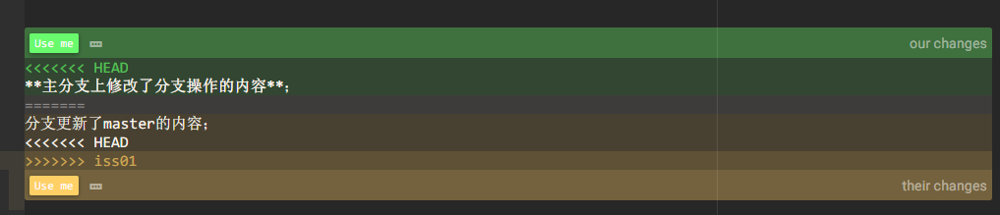

记录如何进行分支操作；

首先创建分支--iss01,对此文件内容进行修改，在新创建一个文件；

再讲主分支向前推进，而后将分支iss01he合并到主分支上；

<<<<<<< HEAD
**主分支上修改了分支操作的内容**；
=======
分支更新了master的内容；
<<<<<<< HEAD

>>>>>>> iss01

结论：

new分支的文件与master分支的文件操作有如下3中关系；

1. master分支下修改了master分支下的文档；
2. new分支下修改了new分支下的文档；
3. master分支和new分支下共同修改了同一个文档；

将new分支合并到master分支的结果为：

1. master分支上的文件依然为master分支上修改的记录；
2. new分支上的文件会被看在master分支上新创建文件，需要重新add以及commit；
3. master分支和new分支上的内容起到了冲突，此时Git会暂停下来，等待去解决合并产生的冲突；

如何解决合并产生的冲突

可以在合并冲突后的任意时刻使用`git status`命令来查看那些阴包含合并冲而处于未合并(unmerged)状态的文件：

查看文件出现如下式样：

这表示 `HEAD` 所指示的版本（也就是你的 `master` 分支所在的位置，因为你在运行 merge 命令的时候已经检出到了这个分支）在这个区段的上半部分（`=======` 的上半部分），而 `iss01` 分支所指示的版本在 `=======` 的下半部分。 为了解决冲突，你必须选择使用由 `=======` 分割的两部分中的一个，或者你也可以自行合并这些内容。

如果根据Git status的提示内容，将该文件进行add，commit的操作，上述绿色和黄色两种改动都会保留（目前我是这么做的）。

或者手动选择保留一项。

根据[git手册](https://git-scm.com/book/zh/v2/Git-%E5%88%86%E6%94%AF-%E5%88%86%E6%94%AF%E7%9A%84%E6%96%B0%E5%BB%BA%E4%B8%8E%E5%90%88%E5%B9%B6)中介绍，还可以通过图形化工具进行合并，但尝试之后并未成功。

\=\=\=\=\=\=\=

new分支上修改相同文件的内容了；

现在在做修改尝试；
>>>>>>> iss01
